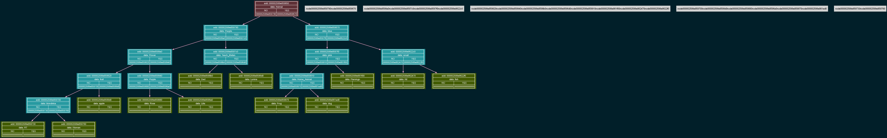

# Akinator: Decision Tree Expert System

A C-based implementation of the classic "Akinator" guessing game. This project demonstrates proficiency in dynamic data structures (binary trees), file serialization/deserialization, and graphical memory state visualization.

## Technical Architecture

The core of the application is a **Binary Decision Tree**. Each node represents either a question (internal nodes) or a final object (leaf nodes). 

### Key Features:
* **Interactive Guessing Mode:** Traverses the tree based on user input (`yes`/`no`). If the system fails to guess the object, it dynamically expands the tree by asking the user for the new object and a distinguishing question.
* **Database Serialization:** The current state of the knowledge tree can be saved to a text file (`tree.txt` or `akinator_db.txt`). The system uses a recursive pre-order traversal format with strict bracket syntax `(...)` to accurately preserve the tree structure for future sessions.
* **Custom File Parser:** Includes a robust recursive descent parser (`TreeRead.cpp`) that reads the serialized database from the file and perfectly reconstructs the dynamic binary tree in heap memory upon startup.
* **Graphical Graphviz Dump:** For debugging and structural visualization, the program can serialize the entire tree into a `.dot` file. Using Graphviz, this is rendered into an easy-to-read `.png` image, showing the memory addresses, parent-child relationships, and data of each node.

## Visualization Example
*Here is how the decision tree looks internally during execution:*


*(Generated automatically via `Graph_DUMP.cpp`)*

## Build and Execution

The project is managed via a standard `Makefile`.

### Prerequisites
* A C++ Compiler (GCC/Clang)
* `make` utility
* [Graphviz](https://graphviz.org/) (required to generate the `.png` tree dumps)

### Compilation
Clone the repository and compile the source code:
```bash
git clone [https://github.com/your-username/Akinator.git](https://github.com/your-username/Akinator.git)
cd Akinator
make